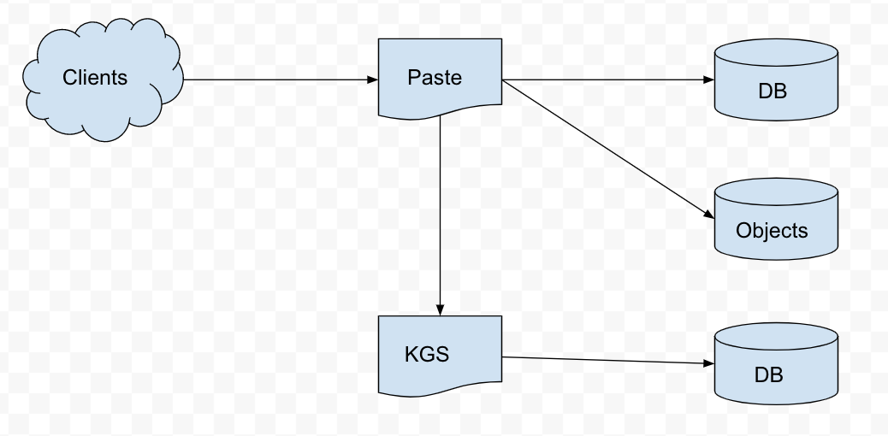
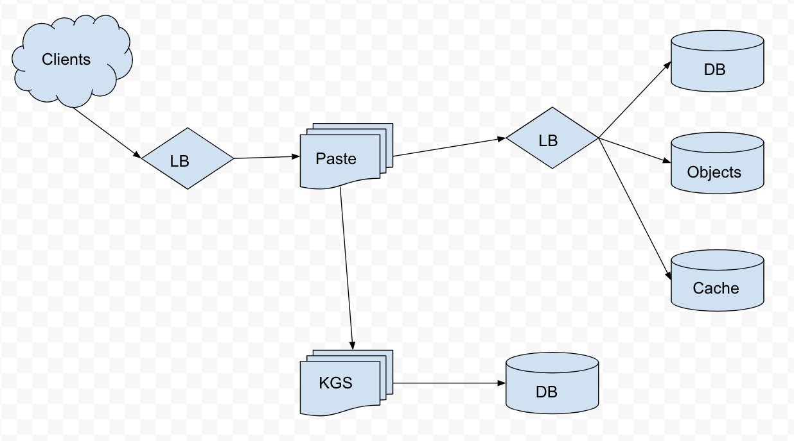

# Paste Bin

## (1) Problem
Design a Pastebin service

## (2) Requirements
- Functional Requirements
  - Give text, get link to text paste
  - Give optional expire time, title, folder for paste, paste link hash
  - Allow users for private pastes
  - Give link, get text paste
- Non-Functional Requirements
  - Service should be available and efficient
  - Links shouldn't be guessable
- Extended Requirements
  - Analytics of paste creation and sharing

## (3) Estimates
What's the traffic needs? Assume 15M new pastes per month and 100:1 read:write ratio. What's the QPS?

(15M write/month) x (month/30 day) x (day/24 hour) x (hour/3600 sec) = 6 write/sec

(6 write/sec) x (100 read/write) = 600 read/sec

What's the storage needs? Assume a paste has at most 512KB and pastes are saved for at most 5 years.

(512 KB/write) x (15M write/month) x (12 month/year) x (5 year) = 460 TB

What's the bandwidth need?

(512 KB/write) x (6 write/sec) = 3MBps

(512 KB/read) x (600 read/sec) = 300MBps

A cache could be used for hot pastes. Assume an 80/20 rule for hot pasts. What's the memory needs?

(512 KB/read) x (600 read/sec) x (3600 sec/hour) x (24 hour/day) x 0.2 = 5.3 GB/day

|||
|---|---|
| read bandwidth | 300 MBps |
| write bandwidth | 3 MBps |
| storage | 460 TB |
| memory | 5.3 GB |
| no. pastes | 900 M |

## (4) System APIs
- createPaste(apiKey, text, title="", folder="", expireAt="", username="")
  - apiKey: Backend service authorization
  - text: Paste text
  - folder: Paste folder
  - expireAt: Expire time
  - username: Paste creator
  - -> paste link on success, null on failure
- readPaste(apiKey, pasteKey)
  - apiKey: Backend service authorization
  - pasteKey: Object storage key for paste text object
  - -> paste text on succes, null on failure
- deletePaste(apiKey, pasteKey)
  - apiKey: Backend service authorization
  - pasteKey: Object storage key for paste text object
  - -> true on success, false on failure

## (5) Database Design

| Paste |
|---|
| pk: hash: varchar(16) |
| text: varchar(512) |
| title: varchar(32) |
| folder: varchar(32) |
| expireAt: datetime |
| userID: int |

| User |
|---|
| pk: userID: int |
| username: varchar(32) |
| email: varchar(32) |

A Paste's text can be stored in object storage which let's the database scale better. The database is expected to grow which suggests using a NoSQL database.

## (6) System Design
Paste text could be uniquely hashed then encoded for a hash, but paste text may not be unique. Users could be asked to create accounts and login to create a create a hash including their userID, but doing so is too much a hassle. Using an incrementing int could overflow.

Creating hashes online is difficult, so create hashes offline using a key generating service (KGS). When a paste is deleted the key can be returned to the KGS; use base36 [a-z, 0-9] encoding with 6 char hash key.

## (7) System Design Detail
Use weights round robin scheme for load balancers, LRU eviction policy for caches. Analytics can track popular pastes and locations. Private pastes for users could be made with a column for a paste url and rows for allowed visitors. A cleanup service can be used for puring expired pastes during low traffic, and can be preffered over lazy cleanup so no paste stays too long.

KGS is a single point of failure, use replica standby to fix the single point of failure. A paste service instance can hold a cache of KGS keys. If the cache dies those keys will be lost. There are many more keys than needed so losing some can be ok.

