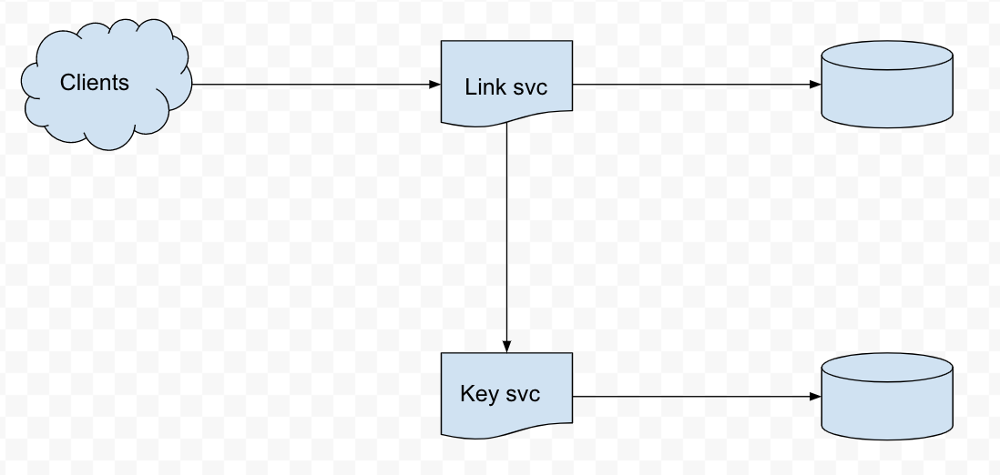
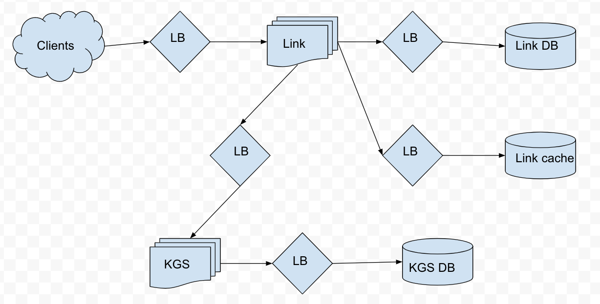

# Tiny URL

## (1) Problem
Design a URL short link service

## (2) Requirements
* Functional Requirements
  * Give long link get short link
  * Choose alias for long link
  * Give short link get long link
  * Delete short link
* Non-Functional Requirements
  * Service be available and efficient
  * Short links shouldn't be guessable
* Extended Requirements
  * Analytics of redirects

## (3) Estimates
What are the **traffic** loads? Assume ervice will be read heavy with 100:1 read:write ratio. Assume 500M writes per month.

(500M writes/month) x (100 read/write) = 50B read/month

What's the QPS? (Queries Per Second)

(500M writes/month) x (month/30 days) x (day/24 hour) x (hour/3600 sec) = 200 write/second

(200 write/sec) x (100 read/write) = 20K read/sec

What are the **storage** needs? Assume long links are 500 bytes. Assume long links are stored for 5 years.

(500M write/month) x (12 month/year) x (5 year) x (500 byte/write) = 15 TB

A cache can be used for hot links. Assume 80/20 rule for hot links. What **memory** is needed?

(500 byte/read) x (20K read/sec) x (3600 sec/hour) x (24 hour/day) = 8.7 GB

|||
|---|---|
| read traffic | 200 read/sec |
| write traffic | 20K write/sec |
| storage | 15 TB|
| memory | 8.7 GB |

## System APIs

* createShortLink(apiKey, longLink, alias="", expireAt="", username="")
  * apiKey: Other services may need to interact with data
  * longLink: Link to convert
  * alias: Optional alias for long link
  * expireAt: Optional expire date
  * username: Optional username
  * -> return: shortLink
* readShortLink(apiKey, shortLink)
  * -> return: longLink
* deleteShortLink(apiKey, shortLink)
  * -> return: null

## Database Design
| Link |
|---|
| pk: hash: varchar(16) |
| url: varchar(512) |
| alias: varchar(16) |
| expireAt: datetime |
| userID: int |

| User |
|---|
| pk: userID: int |
| name: varchar(32) |
| email: varchar(32) |

SQL or NoSQL? The structure of the data may change, and the size of the data is growing. NoSQL will be a better choice.

## System Design
Online hash generation can be tricky, let's use an offline key generating service. When a key is used, remove the key from the KGS. When the key is released, add the key back to the KGS.

## Detailed System Design

Assume the load balancer uses weighted round robin scheme. Assume cache uses LRU eviction policy. There should be a cleanup service which purges link database of old links, and the service can run in offpeak hours. Purging is better than lazy cleanup so links don't live forever. An analytics service can also track redirects.
